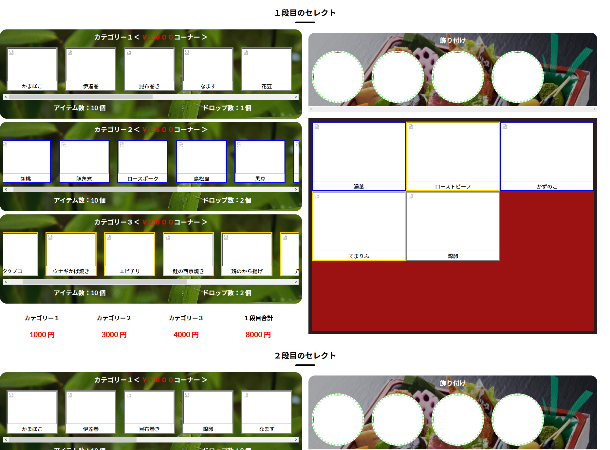

# おせちのオーダーフォーム
以前制作依頼されたものですが、中止になってしまったものです。
おせちの内容をドラック＆ドロップで選択して、オーダーを送信する仕様です。

  制作する上で難しかった点は、やはりメインの仕様であるドラック＆ドロップでおせちの具材を自由に選べるようにする機能でした。
  ドラック＆ドロップの機能を実装するにあたってはJSのライブラリーを利用しました。
  おせちの箱に整列させる形で、ドロップできるようにはできましたが、自由に配置させる形にはできていませんでした。
  また、達成できたこととしては、選択エリアからおせちの箱にドロップされた具材を、フォーム送信の形で選択されたデータをサーバーに送信するといった処理は実装できました。

 
<strong>※この案件は私がまだプログラミング初心者のころに取り組んだものになります。</strong>
 

 

